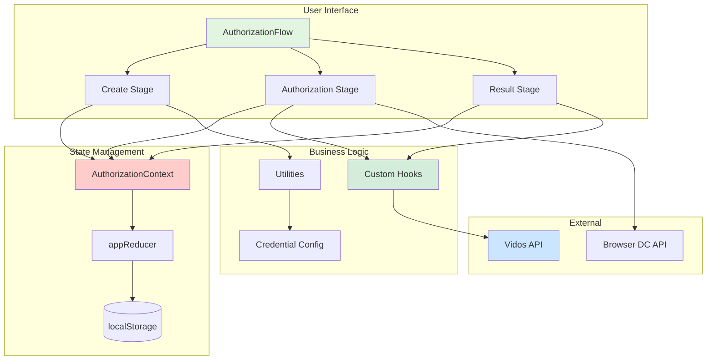
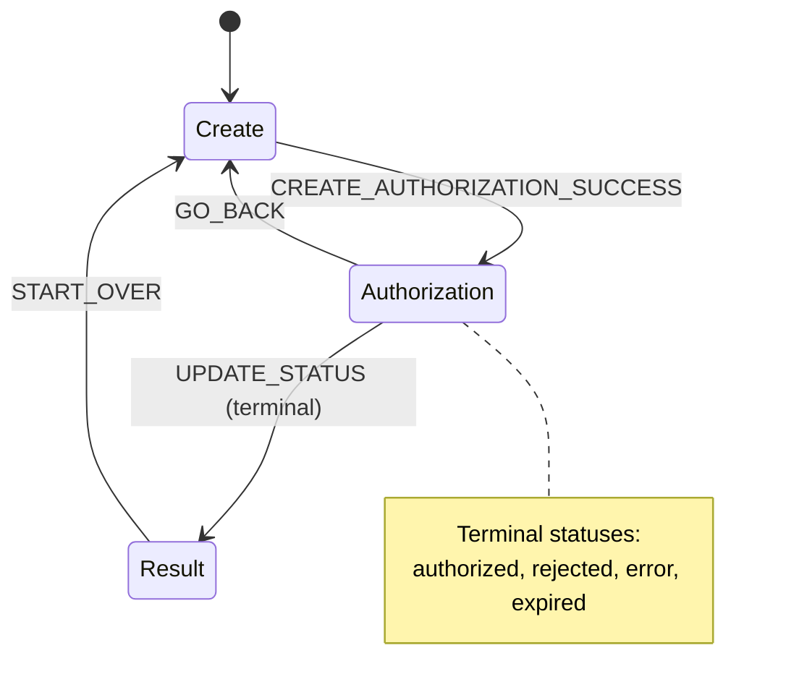
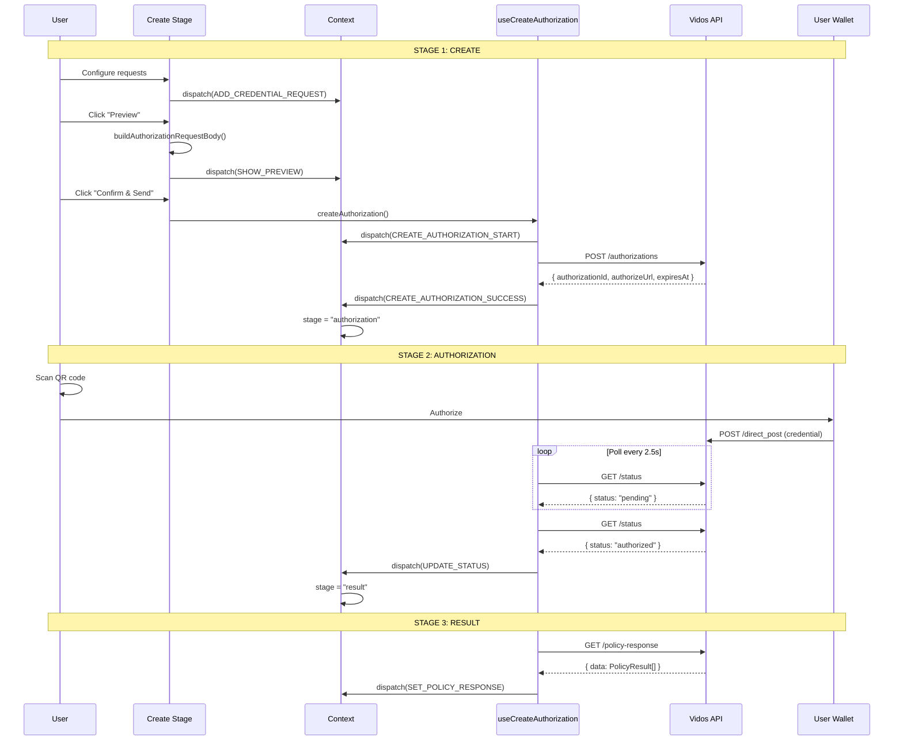
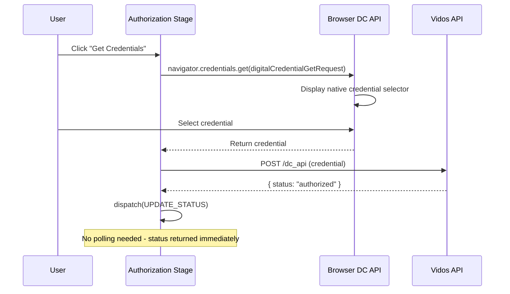
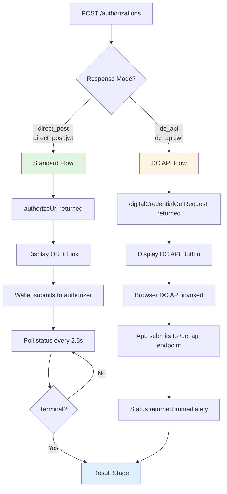

# Codebase Map: Vidos Authorizer Demo

> Auto-generated by Cartographer on 2026-01-14

## System Overview

React+TypeScript+Vite application demonstrating OID4VP (OpenID for Verifiable Presentations) credential verification flows using the Vidos Authorizer API.

**Stack:** Vite 7, React 19, TypeScript strict mode, Tailwind v4, shadcn/ui, openapi-fetch, Bun
**Links:** https://vidos.id | https://dashboard.vidos.id | https://docs.vidos.id

### High-Level Architecture



### Three-Stage Wizard Flow



## Directory Structure

```
src/
├── api/                    # OpenAPI client setup
│   ├── authorizer.ts      # Auto-generated types (NEVER edit manually)
│   └── client.ts          # Client factory
├── components/
│   ├── stages/            # Three wizard stages
│   │   ├── CreateStage/
│   │   ├── AuthorizationStage/
│   │   └── ResultStage/
│   ├── ui/                # shadcn/ui primitives
│   ├── AuthorizationFlow.tsx  # Stage router
│   ├── ProgressIndicator.tsx
│   └── JsonCollapsible.tsx
├── config/
│   └── credential-cases.ts    # Credential type definitions
├── context/
│   └── AuthorizationContext.tsx   # Global state + reducer
├── hooks/
│   ├── useCreateAuthorization.ts
│   ├── useAuthorizationStatus.ts
│   └── usePolicyResponse.ts
├── lib/
│   └── utils.ts           # cn() helper
├── types/
│   └── app.ts             # Type definitions
└── utils/
    ├── requestBuilder.ts  # Build API request body
    ├── queryBuilder.ts    # Build DCQL from credential requests
    ├── dcapi.ts           # DC API browser support
    └── validation.ts      # Request validation

docs/                      # Specification documents
public/                    # Static assets
```

## Module Guide

### Core Application

| File                                 | Purpose                 | Tokens | Key Exports                              |
| ------------------------------------ | ----------------------- | ------ | ---------------------------------------- |
| src/main.tsx                         | Application entry point | 80     | Renders App in StrictMode                |
| src/App.tsx                          | Root component          | 183    | `App` (wraps with AuthorizationProvider) |
| src/components/AuthorizationFlow.tsx | Stage router            | 156    | `AuthorizationFlow`                      |
| src/components/ProgressIndicator.tsx | Wizard progress UI      | 430    | `ProgressIndicator`                      |
| src/components/JsonCollapsible.tsx   | JSON data display       | 361    | `JsonCollapsible`                        |

**Entry point:** main.tsx → App (Provider) → AuthorizationFlow (Router) → Stage Components

### State Management

#### Context & Reducer

**File:** src/context/AuthorizationContext.tsx (1124 tokens)

**Exports:**

- `AuthorizationProvider` - Context provider component
- `useAuthorization()` - Hook to access context (throws if used outside provider)

**State Structure:**

```typescript
interface AppState {
  // Navigation
  stage: "create" | "authorization" | "result";

  // Configuration (persisted to localStorage)
  authorizerUrl: string;

  // Credential Requests (multiple supported)
  credentialRequests: CredentialRequestWithId[];

  // Response Mode Configuration
  responseModeConfig: ResponseModeConfig;

  // Authorization Data
  authorizationId: string | null;
  authorizeUrl: string | null; // Standard flows only
  digitalCredentialGetRequest: unknown | null; // DC API flows only
  authorizationStatus: AuthorizationStatus | null;
  expiresAt: string | null;

  // Results
  policyResponse: PolicyResponse | null;

  // UI State
  isLoading: boolean;
  error: ErrorObject | null;
  showPreview: boolean;
  lastRequest: object | null;
  lastResponse: object | null;
}
```

**Key Actions:**

- `SET_AUTHORIZER_URL` - Persists to localStorage
- `ADD_CREDENTIAL_REQUEST`, `UPDATE_CREDENTIAL_REQUEST`, `REMOVE_CREDENTIAL_REQUEST`
- `SET_RESPONSE_MODE_CONFIG`
- `CREATE_AUTHORIZATION_START/SUCCESS/ERROR`
- `UPDATE_STATUS` - Auto-transitions to result on terminal statuses
- `SET_POLICY_RESPONSE`
- `START_OVER` - Preserves authorizer URL
- `GO_BACK`
- `SHOW_PREVIEW`, `HIDE_PREVIEW`

**Gotchas:**

- Only `authorizerUrl` persisted to localStorage
- `UPDATE_STATUS` automatically transitions to "result" stage when status is terminal
- Backward compatibility maintained with single `credentialRequest` field

#### Type Definitions

**File:** src/types/app.ts (897 tokens)

**Key Types:**

- `AppStage`: "create" | "authorization" | "result"
- `AuthorizationStatus`: "created" | "pending" | "authorized" | "rejected" | "error" | "expired"
- `CredentialFormat`: "dc+sd-jwt" | "mso_mdoc"
- `ResponseMode`: "direct_post" | "direct_post.jwt" | "dc_api" | "dc_api.jwt"
- `DCAPIProtocol`: "openid4vp-v1-unsigned" | "openid4vp-v1-signed"
- `CredentialRequestWithId`: Extends CredentialRequest with UUID
- `ResponseModeConfig`: Mode + optional DC API protocol + expectedOrigins
- `PolicyResponse`, `PolicyResult`: Verification results

### Stage Components

#### Stage 1: Create Authorization

| File                                                           | Purpose                        | Tokens |
| -------------------------------------------------------------- | ------------------------------ | ------ |
| src/components/stages/CreateStage/index.tsx                    | Main orchestrator              | 1010   |
| src/components/stages/CreateStage/AuthorizerConfig.tsx         | URL input                      | 308    |
| src/components/stages/CreateStage/ResponseModeSelector.tsx     | Response mode selection        | 1280   |
| src/components/stages/CreateStage/CredentialRequestList.tsx    | Multiple credential management | 707    |
| src/components/stages/CreateStage/CredentialRequestBuilder.tsx | Individual request config      | 862    |
| src/components/stages/CreateStage/AttributeSelector.tsx        | Attribute selection            | 645    |

**Key Patterns:**

- Two-phase submission: Preview → Confirm & Send
- Validates entire request before submission
- Shows request body preview in JSON

**Dependencies:**

- `useCreateAuthorization` hook for API calls
- `buildAuthorizationRequestBody` utility
- `validateAuthorizationRequest` utility

#### Stage 2: Authorization

| File                                                       | Purpose           | Tokens |
| ---------------------------------------------------------- | ----------------- | ------ |
| src/components/stages/AuthorizationStage/index.tsx         | Main orchestrator | 684    |
| src/components/stages/AuthorizationStage/QRCodeDisplay.tsx | QR code rendering | 139    |
| src/components/stages/AuthorizationStage/AuthorizeLink.tsx | Clickable link    | 121    |
| src/components/stages/AuthorizationStage/DCAPIButton.tsx   | DC API invocation | 727    |

**Conditional Rendering:**

- DC API flows: Display button invoking `navigator.credentials.get()`
- Standard flows: Display QR code + clickable link

**Status Polling:** Via `useAuthorizationStatus` hook (2.5s interval, auto-stops on terminal status)

#### Stage 3: Result

| File                                                | Purpose                   | Tokens |
| --------------------------------------------------- | ------------------------- | ------ |
| src/components/stages/ResultStage/index.tsx         | Main outcome display      | 1023   |
| src/components/stages/ResultStage/PolicyResults.tsx | Policy evaluation results | 1064   |

**Features:**

- Auto-fetches policy response via `usePolicyResponse` hook
- Status-based visual indicators (✓/✗/!/⏱)
- Grouped policy results by credential
- Expandable error/data details

### Hooks

| Hook                   | File                                | Purpose                       | Tokens |
| ---------------------- | ----------------------------------- | ----------------------------- | ------ |
| useCreateAuthorization | src/hooks/useCreateAuthorization.ts | Create authorization API call | 762    |
| useAuthorizationStatus | src/hooks/useAuthorizationStatus.ts | Poll status every 2.5s        | 514    |
| usePolicyResponse      | src/hooks/usePolicyResponse.ts      | Fetch verification results    | 349    |

**useCreateAuthorization:**

1. Validates credentialRequests exist
2. Builds request body via `buildAuthorizationRequestBody`
3. POSTs to `/openid4/vp/v1_0/authorizations`
4. Validates response structure based on mode
5. Dispatches success/error

**useAuthorizationStatus:**

- Polls every 2500ms when on authorization stage
- Auto-stops on terminal statuses: `["authorized", "rejected", "error", "expired"]`
- Dispatches `UPDATE_STATUS` on each check

**usePolicyResponse:**

- Triggers when `authorizationStatus === "authorized"`
- GETs `/openid4/vp/v1_0/authorizations/{id}/policy-response`
- Dispatches `SET_POLICY_RESPONSE`

### Utilities

| Utility        | File                        | Purpose                             | Tokens |
| -------------- | --------------------------- | ----------------------------------- | ------ |
| requestBuilder | src/utils/requestBuilder.ts | Build API request body              | 169    |
| queryBuilder   | src/utils/queryBuilder.ts   | Build DCQL from credential requests | 555    |
| dcapi          | src/utils/dcapi.ts          | DC API browser support              | 195    |
| validation     | src/utils/validation.ts     | Request validation                  | 314    |

**buildAuthorizationRequestBody:**

```typescript
{
  responseMode: responseModeConfig.mode,
  query: buildDCQLQueryMultiple(credentialRequests),
  // DC API specific
  protocol?: responseModeConfig.dcApiProtocol,
  expectedOrigins?: [window.location.origin]
}
```

**buildDCQLQueryMultiple:**

- Converts credential requests to DCQL format
- SD-JWT: Uses `vct_values` array
- mDoc: Uses `doctype_value` string + namespace in paths

**checkDCAPISupport:**

- Returns `{ available: boolean, reason?: string }`
- Checks `navigator.credentials` and `.get()` availability

**validateAuthorizationRequest:**

- Validates URL format, credential requests, attributes, DC API config
- Returns `{ valid: boolean, errors: string[] }`

### Configuration

**File:** src/config/credential-cases.ts (4005 tokens)

**Purpose:** Central registry of credential types, formats, and attributes

**Supported Credentials:**

1. **PID (Person Identification Data)** - SD-JWT + mDoc formats
2. **MDL (Mobile Driving Licence)** - mDoc only
3. **Photo ID** - SD-JWT + mDoc formats

**Helper Functions:**

- `getCredentialCase(id)` - Lookup by document type
- `getFormatDefinition(documentType, format)` - Get specific format
- `getFormatDefinitionById(formatId)` - Direct lookup
- `getAvailableFormats(documentType)` - List formats

**Path Differences Example:**

```typescript
// SD-JWT path
["family_name"][
  // mDoc path (includes namespace)
  ("eu.europa.ec.eudi.pid.1", "family_name")
];
```

**Important:** `required: true` means issuer MUST include in credential, NOT whether disclosure is mandatory during verification.

### API Integration

**File:** src/api/client.ts (39 tokens)

**Export:** `createAuthorizerClient(baseUrl)`

- Returns typed openapi-fetch client
- All endpoints type-safe via auto-generated types

**API Endpoints:**

| Endpoint                                               | Method | Purpose                    | Returns                                                                       |
| ------------------------------------------------------ | ------ | -------------------------- | ----------------------------------------------------------------------------- |
| `/openid4/vp/v1_0/authorizations`                      | POST   | Create authorization       | `{ authorizationId, authorizeUrl?, digitalCredentialGetRequest?, expiresAt }` |
| `/openid4/vp/v1_0/authorizations/{id}/status`          | GET    | Poll status                | `{ status: AuthorizationStatus }`                                             |
| `/openid4/vp/v1_0/authorizations/{id}/policy-response` | GET    | Fetch results              | `{ data: PolicyResult[] }`                                                    |
| `/openid4/vp/v1_0/authorizations/{id}/dc_api`          | POST   | Submit DC API response     | `{ status: AuthorizationStatus }`                                             |
| `/openid4/vp/v1_0/authorizations/{id}/dc_api.jwt`      | POST   | Submit DC API JWT response | `{ status: AuthorizationStatus }`                                             |

**CRITICAL:** src/api/authorizer.ts (24423 tokens) is auto-generated. NEVER edit manually. Regenerate via `bun run generate-api:prod`.

### UI Component Library

All UI components from shadcn/ui "new-york" style, built on Radix UI primitives.

| Component   | File                              | Radix Primitive             | Tokens |
| ----------- | --------------------------------- | --------------------------- | ------ |
| Accordion   | src/components/ui/accordion.tsx   | @radix-ui/react-accordion   | 474    |
| Alert       | src/components/ui/alert.tsx       | Native div                  | 445    |
| Badge       | src/components/ui/badge.tsx       | @radix-ui/react-slot        | 416    |
| Button      | src/components/ui/button.tsx      | @radix-ui/react-slot        | 594    |
| Card        | src/components/ui/card.tsx        | Native div                  | 524    |
| Checkbox    | src/components/ui/checkbox.tsx    | @radix-ui/react-checkbox    | 282    |
| Collapsible | src/components/ui/collapsible.tsx | @radix-ui/react-collapsible | 177    |
| Input       | src/components/ui/input.tsx       | Native input                | 229    |
| Label       | src/components/ui/label.tsx       | @radix-ui/react-label       | 144    |
| Radio Group | src/components/ui/radio-group.tsx | @radix-ui/react-radio-group | 357    |
| Select      | src/components/ui/select.tsx      | @radix-ui/react-select      | 1573   |
| Separator   | src/components/ui/separator.tsx   | @radix-ui/react-separator   | 162    |
| Skeleton    | src/components/ui/skeleton.tsx    | Native div                  | 70     |

**Common utilities:** src/lib/utils.ts exports `cn()` helper (clsx + tailwind-merge)

## Data Flow Diagrams

### Complete Flow: Standard OID4VP (direct_post)



### DC API Flow



### Response Mode Divergence



## Conventions

### Code Style

- **Indentation:** Tabs (Biome enforced)
- **Quotes:** Double quotes
- **Imports:** Auto-organized by Biome
- **Naming:** camelCase for functions/variables, PascalCase for components/types

### Component Patterns

1. **Presentational:** Props-based, no context, pure rendering
2. **Container:** Context consumers, business logic, child orchestration
3. **Custom Hooks:** Encapsulate side effects, minimal API

### State Management

- Single source of truth: AuthorizationContext
- Action-based updates via reducer
- Only authorizerUrl persisted to localStorage

### Type Safety

- Strict TypeScript mode
- OpenAPI-generated types for API
- No `any` types in application code (except type assertions for OpenAPI body)

### Path Aliases

- `@/*` resolves to `src/*`
- Configured in tsconfig.json + vite.config.ts

## Gotchas

### Critical Constraints

1. **NEVER EDIT** src/api/authorizer.ts - Auto-generated from OpenAPI spec
2. **localStorage** - Only `authorizerUrl` persisted, no sensitive data
3. **DC API Browser Support** - Check via `checkDCAPISupport()` before enabling
4. **Terminal State Transition** - Reducer auto-transitions to "result" stage
5. **Response Mode Endpoints** - DC API uses different endpoints than direct_post

### Response Mode Differences

| Aspect       | Direct Post                 | DC API                        |
| ------------ | --------------------------- | ----------------------------- |
| API Returns  | `authorizeUrl`              | `digitalCredentialGetRequest` |
| Display      | QR code + link              | Button                        |
| User Action  | Scan/click → Wallet         | Click → Browser API           |
| Status Check | Poll every 2.5s             | Immediate from submission     |
| Submission   | Wallet → Authorizer         | App → Authorizer              |
| Endpoints    | Wallet calls `/direct_post` | App calls `/dc_api`           |

### DCQL Path Differences

```typescript
// SD-JWT
path: ["family_name"];

// mDoc (includes namespace)
path: ["eu.europa.ec.eudi.pid.1", "family_name"];

// Nested SD-JWT
path: ["address", "formatted"]; // resident_address
path: ["age_equal_or_over", "18"]; // age_over_18
```

### Attribute Required Field

The `required: boolean` in credential-cases.ts means:

- `true` = Issuer MUST include in issued credential
- `false` = Issuer MAY omit from issued credential
- **NOT** whether disclosure is mandatory during verification
- All attributes support selective disclosure

## Navigation Guide

### Adding a New Credential Type

1. **src/config/credential-cases.ts:412** - Define formats and attributes
2. **src/config/credential-cases.ts:97** - Add to `CREDENTIAL_CASES` array
3. No UI changes needed (dynamically driven by config)

### Modifying the Authorization Request

1. **src/types/app.ts:28** - Update types
2. **src/utils/requestBuilder.ts:7** - Modify `buildAuthorizationRequestBody()`
3. **src/utils/validation.ts:5** - Update validation rules
4. **src/components/stages/CreateStage/** - Update UI components

### Adding a New Response Mode

1. **src/types/app.ts:13** - Add to `ResponseMode` union
2. **src/components/stages/CreateStage/ResponseModeSelector.tsx:35** - Update UI
3. **src/utils/requestBuilder.ts:7** - Update request builder logic
4. **src/hooks/useCreateAuthorization.ts:24** - Update response handling
5. **src/components/stages/AuthorizationStage/index.tsx:14** - Add conditional rendering

### Regenerating API Types

```bash
bun run generate-api:prod
```

Fetches latest OpenAPI spec from Vidos and regenerates src/api/authorizer.ts.

### Debugging State Issues

1. React DevTools → Components → AuthorizationContext
2. Console log in reducer (temporary case in appReducer)
3. Check `lastRequest` and `lastResponse` in state
4. Enable preview mode in CreateStage to inspect request body

### Common File Locations

```
Need to find...                          Look in...
─────────────────────────────────────────────────────────────────────
Global state                             src/context/AuthorizationContext.tsx
Type definitions                         src/types/app.ts
Credential configurations                src/config/credential-cases.ts
API client setup                         src/api/client.ts
API type definitions (auto-gen)          src/api/authorizer.ts
Create stage UI                          src/components/stages/CreateStage/
Authorization stage UI                   src/components/stages/AuthorizationStage/
Result stage UI                          src/components/stages/ResultStage/
Hooks (side effects)                     src/hooks/
Utilities (pure functions)               src/utils/
UI components (shadcn)                   src/components/ui/
```

---

_This map was generated by Cartographer. For questions about this codebase, refer to the Navigation Guide above._
